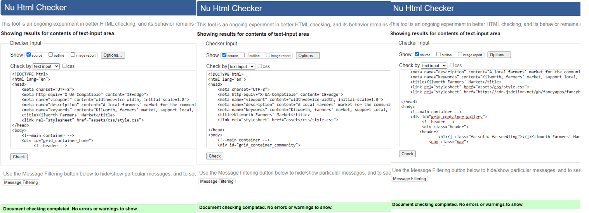

# [Kilworth Farmers' Market](https://ciaralynch72.github.io/ciaralynch-project-1/)

  
Created to inform users about a new (fictional) farmers market that will commence this spring. The site will give users an over of what to expect and information about when and where the market will be held.

##### The business goals of the website are:

1. To let users know about a Saturday farmers market that will be taking place from May to October
2. To encourage visitors of the site to come to the market and purchase products
3. To let local producers and vendors know about a new market and to reach out for more information
4. To show visitors what to expect at the market
5. To relay the market rules to potential visitors 

##### The user goals of the website are:

1. To learn about a new famrers Market in Kilworth
2. To learn about when, where and what time the Market takes place
3. To learn about the goals of the market
4. To be informed of how the market will be run
5. To learn of tips to help the visitor become more substainable
6. To learn about what kind of vendors will be at the market
7. To be able to sign up to find out more information on the market

## UX 
#### Strategy

This site will be used to increase awareness of a new farmers' market to the broader locality and visitors to the area to help boost the local economy and local suppliers and vendors.

Target Users:

1. Those living or visiting the locality of Kilworth
2. Vendors and producers who are living in the community or within driving distance
4. People who wish to support the local economy
5. People who are interested in contributing to making the locality more substainable

What the users are looking for:

1. Information about when and where the farmers market is on
2. To be able find out more information by signing up to join the community
3. To be able to see what vendors will be in attendance

#### Scope
In order to achieve the strategy for both business and user goals I have included the following features:

+ **Header** which is consistent across the Home, Community and Gallery pages
+ **Navigation** to all three pages; Home, Community and Gallery
+ **Footer** which is consistent across all three pages with address of the market and links to social media accounts 
+ **home page** that includes the details of the market 
+ **Community page** with includes substainability tips and market rules 
+ **form** for visitors to join the comminity 
+ **fancybox gallery** to showcase vendors along with a caption of each vendors name to go with the photo

#### Structure
This is a simple three page website that will give users all the necessary information they will need to attend the farmers market or to sign up to find out further information. Users are presented with the most important information on the Home page, when and where the market is on and from there they can easily navigate to the Community and Gallery pages to gain further information about the market. 

Text is broken up with graphics to make the content easily digestable by reader. Each page carries the same look and feel to provide recognition to the user. 

#### Skeleton
Wireframes
1. [Home Page](docs/readme_images/homepage_wireframe.png)
2. [Sign Up Page](docs/readme_images/sign_up.png)
3. [Gallery Page](docs/readme_images/gallery_wireframe.png)

The site layout and content has changed since my initial wireframe however I have kept the simple three page layout. I simplified the design which ment I could achieve responsiveness easier. I kept the content short and sweet to keep the user engaged and to provide a MVP site that can be the basis to suit the markets infancy and which can be developed as the market devolps to provide more functionality to the user and business owener. 

#### Surface

The colour pallette was choosen as a nod to those colors that we so often find in the Irish landscape where our growers and producers live and work. Green was chosen for the header and footer as it is the color we associate with land. The blue and yellow accented throughout represent the sky and sun and the orange is a nod to the earth. All things that are needed for something to grow. The soft colors allow for an easy visual experience for the user and carry accross all pages to allow for familiarity for the user. Whitesmoke was chose as the text in the header, footer and form. Navy was chosen for the main body as I like that it is softer that traditional black and has a high accessiblity score agains the other colors used across the site. 

The font Ralway and Cabin was used as they are lightweight and have more a natural feel to them which I tought comlimented the colors. 

The use of graphics throughout the Home and Community page was used to compliement the colors and to keep the site clean and user friendly and to break up blocks of text to allow the user to take in the information in chunks. 

## Features 

### Current Features 

This is a fully responsive site that was created mobile first. The site is broken up into three pages. 

#### Header
The header is consistent across all three pages. The header contains the name, Kilworth Farmers' Market and the navigation for the site. The navigation and the logo are all centered in the header to allow the user to easily navigate the site from the header. 

#### Navigation 
The navigation is in the center of the page and and consists of three links to the Home, Community and Gallery pages. The navigation links turn orange when hovered over and the current page will be underlined in white to let the user know what page they are currently on. 

#### Footer
The footer is consistent across all three pages at the bottom of the page and the color is consistent with the header to create a balanced page. The footer contains the address of the market along with the social media links to social platforms to allow the user to look at more online content linked too the market. 

#### Home Page
The home page is made up of a hero graphic along with two doodle graphics that I placed on colored backgrounds that tie in with the color scheme to break up the text. I kept the text to a minimum so as not to overwhelm the user but let them know everything they would need in order to learn about the market and know when and where it would be held. 

#### Community Page
The community page follows a similar layout to the home page with minimal copy divided by graphics which use the site colors. There is two main sections here, substainability tips and market rules.

#### Gallery Page
The Gallery page showcases som of the vendors that will be attending the market along with a caption of their names for let site visitors know what they can expect to see at the market. 

The gallery was created using fancybox to allow site visitors to easily browse through the vendors.

At the bottom of the community page there is also a sign up form for page visitors who would like to learn more or leave feedback.

## Future Features

#### Vendor Page
I would like to create a page dedicated to vendors so that we can highlight their business and link page to their own website.

#### Burger Menu
I would like to add a burger menu to the navigation link for smaller devices.

#### Testimonials 
I would like to add testimonials to give the user a sense of impact the market makes to the community

## Technologies Used
I have used several technologies that have enabled this design to work:

- **HTML** used to create the static website
- **CSS** used to style the website
- [**Google Fonts**](https://fonts.google.com/)
    - Used to obtain the fonts Raleway and Cabin
- [Font Awesome](https://fontawesome.com/)
    - Used to obtain the social media icons used in the footer and the icons used on the Home page
- [Google Developer Tools](https://developers.google.com/web/tools/chrome-devtools)
    - Used as a primary method of fixing spacing issues, finding bugs, and testing responsiveness across the project.
- [GitHub](https://github.com/)
    - Used to store code for the project after being pushed.
- [Git](https://git-scm.com/)
    - Used for version control by utilising the Gitpod terminal to commit to Git and Push to GitHub.
- [Gitpod](https://www.gitpod.io/)
    - Used as the development environment.
- [Unicorn Revealer](https://chrome.google.com/webstore/detail/unicorn-revealer/lmlkphhdlngaicolpmaakfmhplagoaln?hl=en-GB)
    - Used to detect overflow of elements, which allowed me to quickly debug any issues.
- [Coloors](https://coolors.co/cf5c36-70a37f-92afd7-274156-ffd166)
    - Used to create a colour palette for the website
- [Fancybox](https://fancyapps.com/fancybox/3/)
    - Used to create the Carousel
- [Color Contrast Accessibility Validator](https://color.a11y.com/)
    - Allowed me to test the colour contrast of my webpage.
- [W3C Markup Validation Service](https://validator.w3.org/) 
    - Used to validate all HTML code written and used in this webpage.
- [W3C CSS Validation Service](https://jigsaw.w3.org/css-validator/#validate_by_input)
    - Used to validate all CSS code written and used in this webpage.
- [AmIResponsive](http://ami.responsivedesign.is/)
    - Used to generate repsonsive image used in README file.
- Photoshop
    - Used to change the line color on the farm graphic on the main page.
- Chrome Developer Tools
    - Used to test the HTML and CSS in the building phase for both functionality and responsiveness
- Paint
    - Used to resize my images for my gallery and to create thumbnails.

## Testing

 ### Validator Testing 

 + Each page of HTML was tested using The Nu Html Checker. 

 

+ CSS was tested using W3C CSS Service. 

 

 ### Lighthouse

 I tested each of my pages on lighthouse for both mobile and desktop.

 + Home Page

   

+ Community Page

  

 + Gallery Page 

   

### Manual Testing

Browsers manually tested:

* Google Chrome
* Mozilla Firefox
* Microsoft EDGE
* Safari

Devices manally tested:
* Samsung A52
* Iphone 8
* Ipad 
* Laptop
* 22" monitor

I used both chrome dev tools and firefox dev tools throughout building my site to check for responsiveness and to make sure it was visually appealing.

 ### User Story Testing

  Expectations
    As a user I wanted to:
      1. Find out information about the market such as when and where it was on
      2. Be able to click through the pages to find out more about the market
      3. To know what to expect at the market 
      4. Be able to ask for more information/give feedback
  Result
    As a user I was able to:
      1. Find out when and where the market was on from the home page
      2. To click through the pages and find further information
      3. I was able to form an opinion on the market
      4. I was able to seek for more information or leave feedback via the form section

      
| Feature           |  Expect              |  Action |  Result                 |
|-------------------|----------------------|---------|-------------------------|
|Nav Home           |To go to Home page    |Click On |Taken to Home Page       |
|Nav Community      |To go to Community page|Click On |Taken to Community Page  |
|Nav Gallery        |To go to Gallery page |Click On |Taken to Gallery Page    |
|Social links       |To go to new tab of social icon |Click On |Taken to social page on new tab|
|Form               |Fill out and submit   |Click On |Taken to Code Institute page and know my form was sent|
|Gallery            |Click images to open carousal|Click On |Larger images opens and I can click though all photos|

### Bugs
No know bugs were found upon submitting the project.

However I did add styling to elements as I built the site to make sure links were clickable on mobile on smaller devices. I made my thumbnails bigger to help with resolution on moible.

## Deployment 

This site was deployed via GitHub pages using the following steps:
1. Open GitHub and locate the [Project 1 Repository](https://ciaralynch72.github.io/ciaralynch-project-1/)
2. At the top of the repository, locate the "Settings" button on the menu
2. In the left-hand navigation section scroll down to the **Pages** button
3. From the source section drop-down menu change Branch from **none** to **main** and click the **Save**
4. After several minutes the website will be live and and there will be the link to [live site](https://ciaralynch72.github.io/ciaralynch-project-1/index.html)

## Credits

- #### Copy
All copy was written by the developer after researching other farmer market websites.

- #### Design
Design was inspired from researching the following sites:
- [Junction Farmers Market](https://junctionmarket.ca/)
- [Cabbage Town Farmers Market](https://www.cabbagetownmarket.ca/)

- #### Media
Images were taken from [Pexels](https://www.pexels.com/collections/agriculture-84ityxd/), [Unsplash](https://unsplash.com/s/photos/farm) and [Ireland's Content Pool](https://www.irelandscontentpool.com/en/_/login?login.redirectlogin=/en) I resized all media with photoshop and paint. 

- #### Graphics
The hero graphic on the main page was downloaded from [here](https://pngset.com/download-free-png-eouky) I used photoshop to alter the graphic color to the navy that I used for the font color. The rest of the graphics were found on [Canva](https://www.canva.com/) and edited directly on the site.

- #### Use of CSS Grid
After researching options of how to build my website I opted to go with a grid layout. I used [W3Schools](https://www.w3schools.com/) and Youtube, most notably [Kevin Powells channel](https://www.youtube.com/kepowob), to get a handle of how I should used grids to create a responsive website.

- #### Gallery layout 
I practiced many ways to layout a grid but [this video](https://www.youtube.com/watch?v=XHPudSzPYVg) really made it all click and work for my layout. 

- #### Fancybox Carousel
My mentor Guido Cecilio suggested fancybox for my gallery to improve used experience. He provided me with the code I needed to get started and I reseached the rest on platforms that I had previously used. 

All captions on the gallery are neighbors and friends names and businesses and I have permission to use them for this project. 

- #### Footer
The footer code is heavily inspired by the Love Running Project that was completed prior to starting the project. 

- #### Slack
Code Institute's slack channel was a huge help in helping with problems and to give a sense of what was expected for projects. Support from fellow students was greatly appreciated.

- #### Mentor
My mentor Guido Cecilio was extremely generous with his time and sharing helpful tips with me throughout out mentor sessions. It really helped to know I was on the right track and to have his expertise to learn from. 

- #### Cohort Facilitators
Code Institutes Facilitators were great throughout the project, answering questiosn and encouraging us to the finish line. They also made it easy to stay on track and keep everyone up to date. Thanks Kenan Wright and Kascia Bogucka.

- #### Code Institute and MSLETB
Big thank you to Code institute for creating such a great learning platform that gave me the tools and knowledge to create this website and for MSLETB for the opportunity to participate in this course. 

